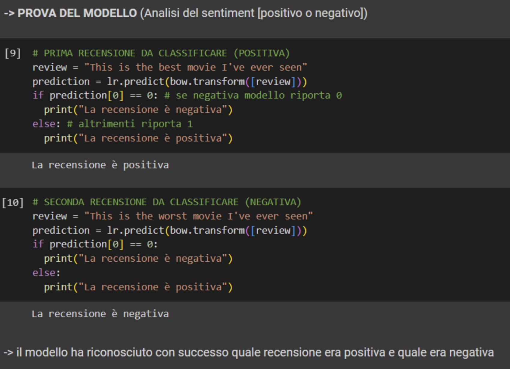
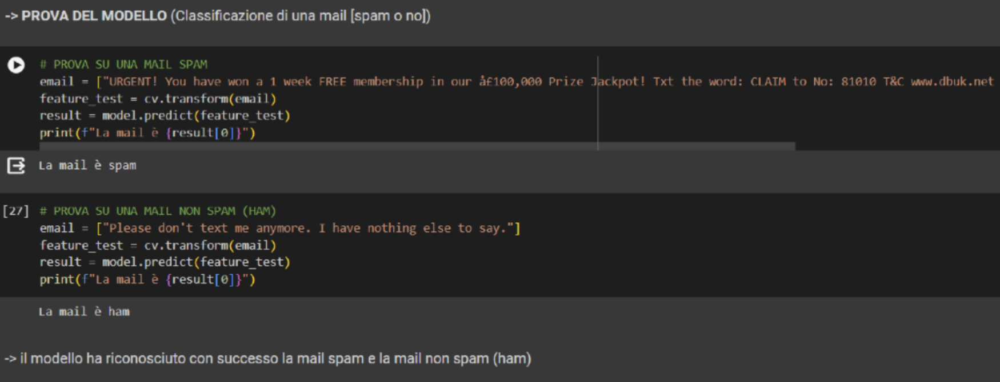
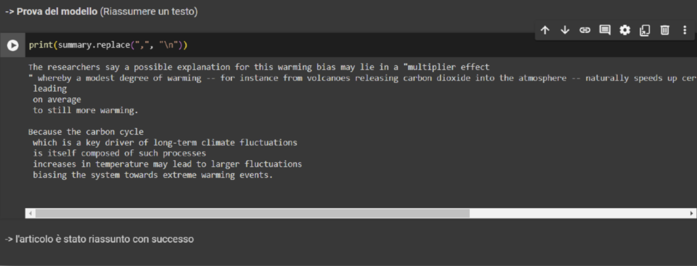

# NLP Classifier Project

## Overview
This repository contains a suite of Natural Language Processing (NLP) tools designed for text classification and summarization. The project showcases the practical application of machine learning models to solve real-world language tasks. It was originally developed as a capstone project inspired by the **Udemy course "Natural Language Processing" by ProfessionAI**.

## Key Features & Performance

### 1. Sentiment Analysis
* **Goal**: Determine if a movie review is positive or negative.
* **Model**: Logistic Regression.
* **Dataset**: Stanford's aclImdb dataset.
* **Performance**: Achieved **87.75% Test Accuracy**.

[Citation: Classification_original.pdf](docs/Classification_original.pdf)

### 2. Spam Detection
* **Goal**: Classify emails/SMS as 'spam' or 'ham' (legitimate).
* **Model**: Support Vector Machine (SVM).
* **Performance**: Achieved **98.47% Accuracy**.

[Citation: Classification_original.pdf](docs/Classification_original.pdf)

### 3. Extractive Text Summarizer
* **Library**: spaCy (`en_core_web_sm`).
* **Logic**: An extractive approach that ranks sentences based on word frequency to generate concise summaries.

[Citation: Classification_original.pdf](docs/Classification_original.pdf)

## Interactive UI
The project includes a **Streamlit** web application, allowing users to interact with the models in real-time. Users can input custom text for sentiment analysis or upload `.txt` files for automatic summarization.

## Tech Stack
* **Language**: Python 3
* **Libraries**: Scikit-learn, Pandas, spaCy, Newspaper3k, Streamlit, Matplotlib, Seaborn
* **Environment**: Developed using Google Colaboratory

## Project History
This project was initially developed in **April 2024**. The source code has been refactored for English-speaking professional environments, while the original project documentation (in Italian) is available in the `docs/` folder for historical reference.

## License
This project is licensed under the **MIT License**. Please see the [LICENSE](LICENSE) file for details.